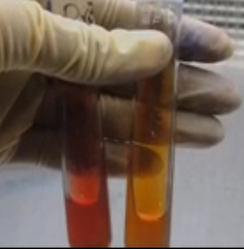
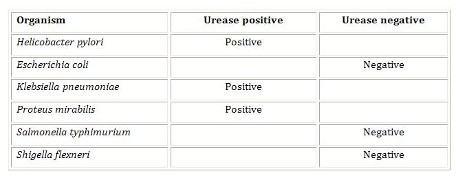

### Materials Required:
 

### Cultures:
24-48 hours tryptic soy broth cultures.

### Media:
 
Urea broth.
Urea slant.

 

### Equipments:
 
Bunsen burner.
Inoculating loop.
Test tubes.
Marking pen.
 

### Media Preparation:
 
Urea test broth is prepared by adding 20 g of urea, 9.5 g of Na2HPO4, 9.1 g of KH2PO4, 0.1g of yeast extract and 0.01 g of phenol red. The pH is made to 6.8±0.2 at 25°c.

 
Urea slants are prepared in the same way as the preparation of broth, but add agar also. Mix thoroughly and dispense aseptically in sterile tubes. Cool the tubed medium in a slanted position so that deep butts are formed.

 
&nbsp;

## Procedure:
 

Using a sterile technique, inoculate each experimental organism into its appropriately labeled tube by means of loop inoculation. Incubate cultures 24-48 hours at 37°C.

 

### a) Urea Broth method:
 

1. Sterilize the loop in the blue flame of the Bunsen burner till red hot. Heat from the base of the wire first and slowly move towards the loop (tip). Heat the wire until it is red-hot and then allowed to cool.

2. Take out a loopful organism from the tryptic broth culture tube with the cooled loop aseptically.

3. Again flame the neck of the tube and replace the tube in the test tube rack.

4. Take a sterile urea broth tube, remove the cap and flame the neck of the tube.

5. Inoculate the urea broth with the inoculation loop containing the organism from the tryptic soy broth culture.

6. Again flame the neck of the urea tube and place it in the test tube rack.

7. Incubate for 24-48 hours at 37°C.

8. Obtain the broths from the incubator and observe the colour.

&nbsp;

### b) Urea Slant method:
 

1. Sterilize the loop in the blue flame of the Bunsen burner till red hot and then allowed to cool.

2. Take out a loopful organism from the tryptic broth culture tube with the cooled loop aseptically.

3. Again flame the neck of the tube and replace the tube in the test tube rack.

4. Take a sterile urea slant tube remove the cap and flame the neck of the tube.

5. Inoculate the entire surface of the urea slant (slope) with the provided growth from the tryptic broth culture using the inoculating loop (do not stab the butt). The slant of the medium is inoculated by streaking the surface of the agar in a zigzag manner.

6. Again flame the neck of the urea tube and place it in the test tube rack.

7. Tighten the cap and incubate at 37°C for 24-48 hours.

8. Obtain the tubes from the incubator and observe the colour change.

